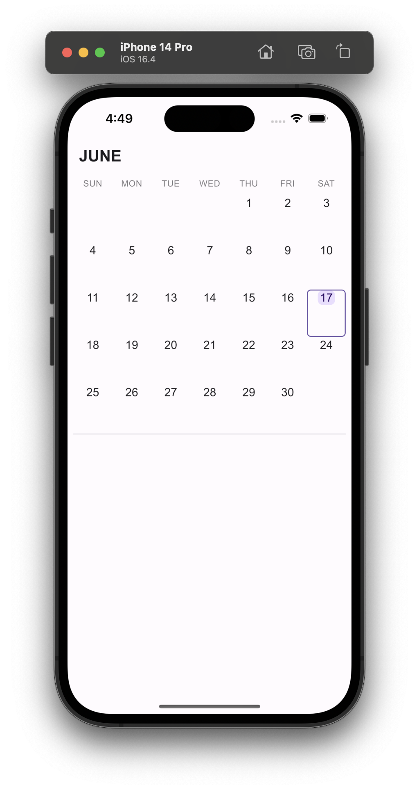
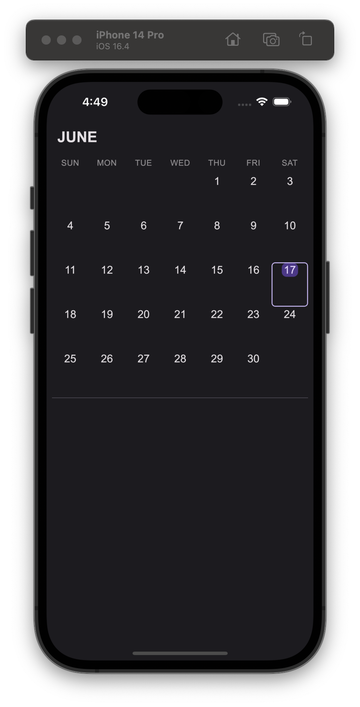

# compose_memories

This is an application built using [Compose Multiplatform](https://github.com/JetBrains/compose-multiplatform-ios-android-template) targeting the Android and iOS platforms.

## Screenshots

 </br>  

## Related

1. [insetsx](https://github.com/mori-atsushi/insetsx)

## License

```
Apache License 2.0
```